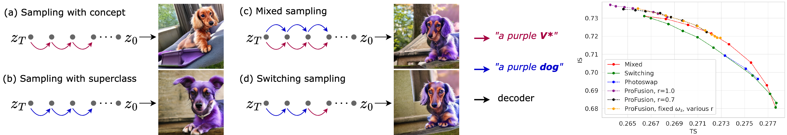

# Beyond Fine-Tuning: A Systematic Study of Sampling Techniques in Personalized Image Generation

<a href="https://arxiv.org/abs/2502.????"></a>

<a href="https://colab.research.google.com/drive/1PNC307ap9rdu7zXw5EOXy_GdITXcZbkq?usp=sharing"></a>
[](./LICENSE)


> Personalized text-to-image generation aims to create images tailored to user-defined concepts and textual descriptions. Balancing the fidelity of the learned concept with its ability for generation in various contexts presents a significant challenge. Existing methods often address this through diverse fine-tuning parameterizations and improved sampling strategies that integrate superclass trajectories during the diffusion process. While improved sampling offers a cost-effective, training-free solution for enhancing fine-tuned models, systematic analyses of these methods remain limited. Current approaches typically tie sampling strategies with fixed fine-tuning configurations, making it difficult to isolate their impact on generation outcomes. To address this issue, we systematically analyze sampling strategies beyond fine-tuning, exploring the impact of concept and superclass trajectories on the results. Building on this analysis, we propose a decision framework evaluating text alignment, computational constraints, and fidelity objectives to guide strategy selection. It integrates with diverse architectures and training approaches, systematically optimizing concept preservation, prompt adherence, and resource efficiency.
> 

<p align="center">
  
  <br>
We analyze sampling strategies in personalized image generation, showing how superclass trajectories optimize fidelity-adaptability tradeoffs and offer a framework for selecting strategies by text alignment, efficiency, and identity preservation.
</p>

## Updates

- [30/01/2025] 🔥🔥🔥 Beyond Fine-Tuning release. Paper has been published on [Arxiv](https://arxiv.org/abs/2502.????)
  
## Prerequisites
You need following hardware and python version to run our method.
- Linux
- NVIDIA GPU + CUDA CuDNN
- Conda 24.1.0+ or Python 3.11+

## Installation

* Clone this repo:
```bash
git clone https://github.com/V-Soboleva/persongen
cd persongen
```

* Create Conda environment:
```bash
conda create -n persongen python=3.11
conda activate persongen
```

* Install the dependencies in your environment:
```bash
pip install -r requirements.txt
```

* Compile binaries for face detection metrics:
```bash
cd nb_utils/face_align/PIPNet/FaceBoxesV2/utils
bash ./make.sh
```

## Training & Inference

Here, you can find examples of how to run training/inference on top of the SD-2.0 model. Detailed instructions for SD-XL and PixArt-alpha are contained in the branches `sdxl` and `pixart`.

[Training cli commands](docs/TRAINING.md)

[Inference cli commands and example notebooks](docs/INFERENCE.md)

## Repository structure

    .
    ├── 📂 baselines                                 
    │   ├── 📂 custom_diffusion                      
    │   │   ├── ...                                  
    │   │   ├── 📄 inference.py                      # Implementation of CD inference
    │   │   └── 📄 train_custom_diffusion.py         # Implementation of CD training
    │   ├── 📂 elite                                 
    │   │   ├── 📂 dreambooth                        
    │   │   ├── ...                                  
    │   │   └── 📄 inference.py                      # Implementation of ELITE inference
    │   ├── 📂 profusion                             
    │   │   ├── 📄 inference.py                      # Implementation of Profusion inference
    │   │   └── 📄 pipeline.py                       # Implementation of Profusion pipelines
    │   └── 📂 textual_inversion                     
    │       ├── 📄 inference.py                      # Implementation of TI inference
    │       └── 📄 textual_inversion.py              # Implementation of TI training
    ├── 📂 docs                                      
    │   ├── 📂 assets                                # Folder with diagrams and teaser
    │   ├── 📜 INFERENCE.md                          # File with inference CLI
    │   └── 📜 TRAINING.md                           # File with training CLI
    ├── 📂 dreambooth                                
    │   ├── 📂 aug_dataset                           # Preprocessed DB datasets for training 
    │   ├── 📂 dataset                               # Original DB datasets for evaluation
    │   └── ...                                      
    ├── 📂 nb_utils                                  # Folder with utility functions
    ├── 📂 persongen                                 
    │   ├── 📂 data                                  # Implementation of image datasets
    │   ├── 📂 model                                 # Implementation of sampling pipelines and SVDDiff
    │   ├── 📂 utils                                 # Folder with utility functions
    │   ├── 📄 ...
    │   ├── 📄 inferencer.py                         # Wrapper for sampling pipelines
    │   └── 📄 trainer.py                            # Wrapper for training methods
    │                                                
    ├── 📜 README.md                                 # This file
    ├── 📜 requirements.txt                          # Lists required Python packages.
    │                                                
    ├── 📄 inference.py                              # Wrapper for inference
    └── 📄 train.py                                  # Wrapper for training


## References & Acknowledgments

The repository has used several codebases:
* [Implementation of Custom Diffusion, and Textual Inversion methods from diffusers](https://github.com/huggingface/diffusers)
* [Implementation of SVDDiff](https://github.com/mkshing/svdiff-pytorch)
* [Pretrained ELITE models and inference code](https://github.com/csyxwei/ELITE)
* [Dreambooth dataset and prompts](https://github.com/google/dreambooth)
* [Implementation of ProFusion sampling](https://github.com/drboog/ProFusion)

## Citation

If you use this code or our findings for your research, please cite our paper:
```
@article{soboleva2025beyondft,
  title={Beyond Fine-Tuning: A Systematic Study of Sampling Techniques in Personalized Image Generation},
  author={Soboleva, Vera and Nakhodnov, Maksim and Alanov, Aibek},
  journal={arXiv preprint arXiv:2502.?????},
  year={2025}
}
```
